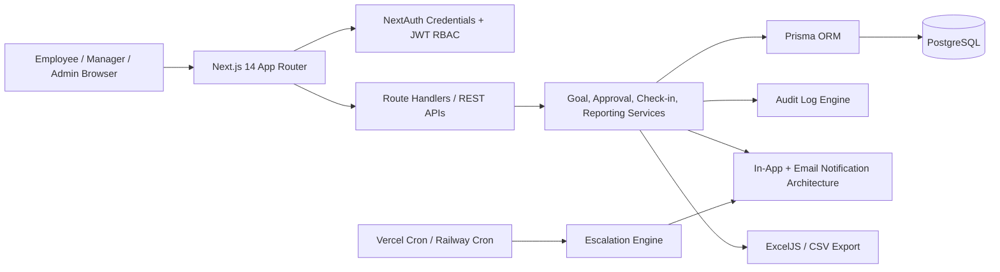

# GoalSphere Architecture

## Cost Optimisation
- Single Next.js deployment for frontend + APIs.
- PostgreSQL on Supabase/Railway free or low-cost tier.
- Prisma indexing on high-read fields.
- Server-side pagination-ready APIs.
- CSV/Excel generated on demand.
